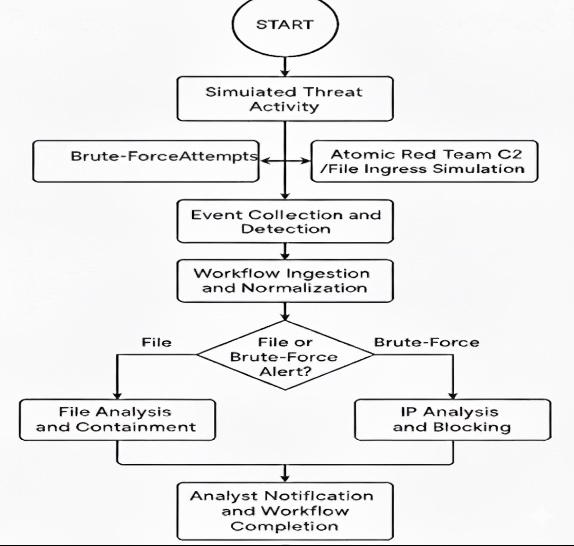
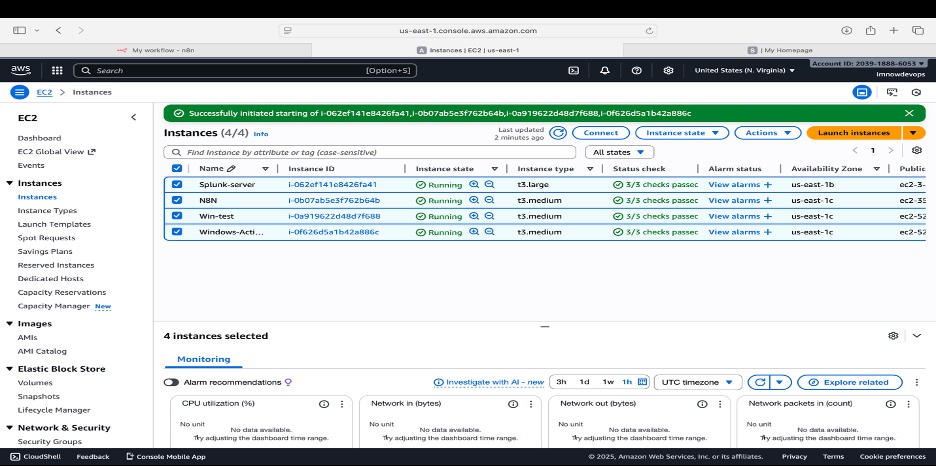
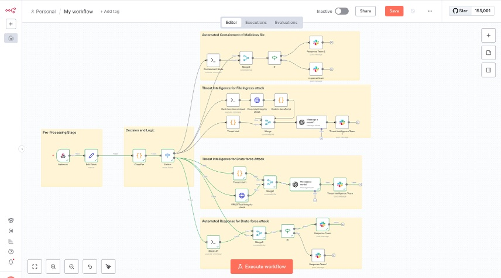
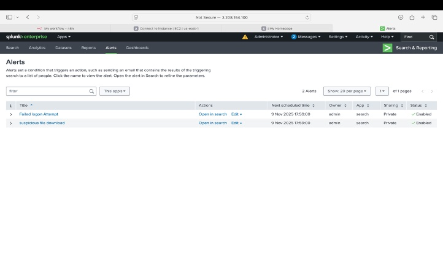
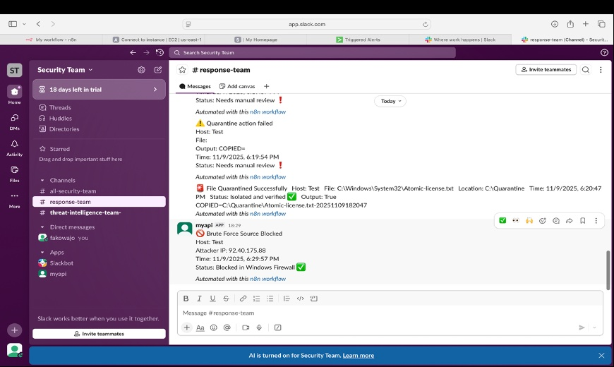
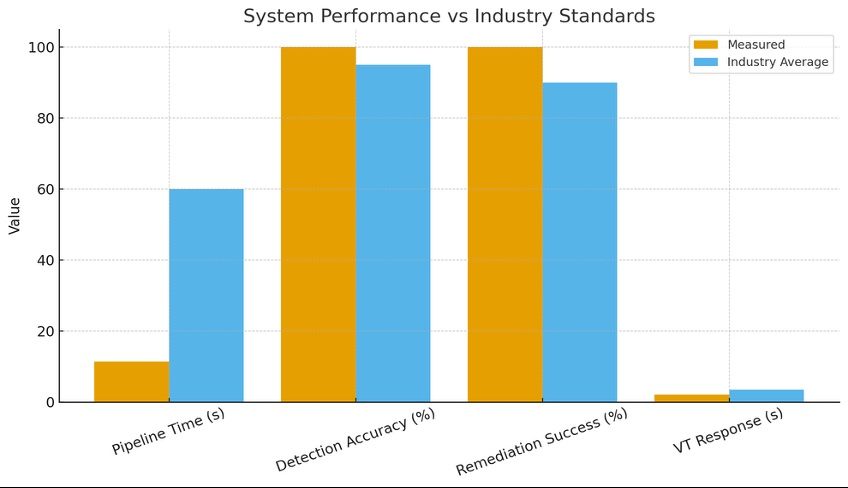

# SOC Architecture — Visual Documentation
### Cloud SOC Automation | Splunk + n8n SOAR + AWS + Slack

> **MSc Dissertation Project** | Kingston University London | Networks and Information Security  
> **Author:** Oluwabukunmi Fakowajo  
> **Full project repo:** [cloud-soc-automation](https://github.com/fakowajo123/cloud-soc-automation)

---

This repository contains all architecture diagrams, workflow screenshots, and performance benchmarks from the Cloud SOC Automation project — a fully cloud-hosted Security Operations Centre simulation built on AWS, integrating Splunk SIEM, n8n SOAR, Sysmon, VirusTotal, and Slack.

---

## Table of Contents

1. [Attack Simulation and Validation Workflow](#1-attack-simulation-and-validation-workflow)
2. [AWS Cloud Infrastructure](#2-aws-cloud-infrastructure)
3. [n8n Automated Response Workflow](#3-n8n-automated-response-workflow)
4. [Splunk SIEM — Active Alerts](#4-splunk-siem--active-alerts)
5. [Slack — Real-Time Analyst Notifications](#5-slack--real-time-analyst-notifications)
6. [System Performance vs Industry Benchmarks](#6-system-performance-vs-industry-benchmarks)

---

## 1. Attack Simulation and Validation Workflow

**What this shows:**

The end-to-end attack simulation and automated response flow. Starting from simulated threat activity, the system branches into two attack paths — Brute Force attempts and Atomic Red Team C2/File Ingress simulation. Both paths feed into Event Collection and Detection via Splunk, which ingests and normalises the telemetry before routing through the n8n decision logic.

The decision node classifies the alert as either a File alert (routed to File Analysis and Containment) or a Brute Force alert (routed to IP Analysis and Blocking). Both paths converge at Analyst Notification and Workflow Completion, where a Slack message is sent to the SOC team with full enrichment data.

**Key components:**
- Atomic Red Team — MITRE ATT&CK-mapped attack simulation
- Splunk — Event collection and detection
- n8n — Workflow ingestion, normalisation, and routing
- Slack — Final analyst notification

---

## 2. AWS Cloud Infrastructure

**What this shows:**

The live AWS EC2 console showing all 4 running instances in the us-east-1 region that make up the SOC lab environment. All instances are in a running state with 3/3 status checks passed.

| Instance | Type | Purpose |
|----------|------|---------|
| Splunk-server | t3.large | Splunk SIEM — log ingestion and alerting |
| N8N | t3.medium | n8n SOAR — automation and playbook execution |
| Win-test | t3.medium | Windows victim VM with Sysmon telemetry |
| Windows-Acti... | t3.medium | Windows Active Directory domain controller |

All instances assigned Elastic IPs for stable addressing. The Kali Linux attacker VM was spun up separately for attack simulation sessions.

---

## 3. n8n Automated Response Workflow

**What this shows:**

The complete n8n SOAR workflow canvas showing all four automated response pipelines operating in parallel. The workflow is divided into clearly labelled stages:

**Pre-Processing Stage (left panel)**
- Webhook node — receives alert payload from Splunk
- Edit Fields node — normalises incoming data
- Classifier (JavaScript) — classifies alert type and severity
- Switch (IF node) — routes to appropriate response pipeline

**Four response pipelines (right panels):**

| Pipeline | Trigger | Actions |
|----------|---------|---------|
| Automated Containment of Malicious File | File Ingress alert | Quarantine file, notify Response Team via Slack |
| Threat Intelligence for File Ingress | File hash enrichment | Hash function extraction, VirusTotal check, Slack notification to Threat Intelligence Team |
| Threat Intelligence for Brute Force | Brute Force alert | VirusTotal IP lookup, Slack notification to Threat Intelligence Team |
| Automated Response for Brute Force | Brute Force alert | Block attacker IP, notify Response Team via Slack |

Each pipeline terminates with a Slack notification to the appropriate team channel with full enrichment data.

---

## 4. Splunk SIEM — Active Alerts

**What this shows:**

The Splunk Enterprise Alerts dashboard showing the two active detection rules configured for this project. Both alerts are enabled and scheduled to run at 17:59:00 on 9 November 2025.

| Alert Name | Purpose | Status |
|------------|---------|--------|
| Failed Logon Attempt | Detects repeated failed authentication — triggers brute force response pipeline | Enabled |
| Suspicious File Download | Detects suspicious file creation via Sysmon EventCode 11 — triggers file containment pipeline | Enabled |

Each alert is configured with a webhook action that sends the alert payload to the n8n SOAR instance, triggering the appropriate automated response playbook.

---

## 5. Slack — Real-Time Analyst Notifications

**What this shows:**

The Slack `#response-team` channel receiving live automated notifications from the n8n SOAR workflows. Three real alerts are visible:

**Alert 1 — Quarantine Action Failed**
> ⚠️ Quarantine action failed  
> Host: Test | File: | Output: COPIED  
> Status: Needs manual review ❗  
> *Automated with n8n workflow*

Demonstrates the system's ability to flag partial failures and escalate for manual analyst review — maintaining human oversight even when automation encounters errors.

**Alert 2 — File Quarantined Successfully**
> 📁 File Quarantined Successfully  
> Host: Test | File: C:\Windows\System32\Atomic-license.txt  
> Location: C:\Quarantine | Output: True  
> COPIED: C:\Quarantine\Atomic-license.txt-20251109182047  
> *Automated with n8n workflow*

Shows successful automated file containment with full audit trail including timestamp and destination path.

**Alert 3 — Brute Force Source Blocked**
> 🛡️ Brute Force Source Blocked  
> Host: Test | Attacker IP: 92.40.175.88  
> Time: 11/9/2025, 6:29:57 PM  
> Status: Blocked in Windows Firewall ✅  
> *Automated with n8n workflow*

Shows successful automated IP blocking via Windows Firewall rule, triggered by the brute force detection pipeline.

---

## 6. System Performance vs Industry Benchmarks

**What this shows:**

Comparative bar chart measuring the system's performance against industry average benchmarks across four key metrics.

| Metric | System Result (Orange) | Industry Average (Blue) | Verdict |
|--------|----------------------|------------------------|---------|
| Pipeline Time (s) | ~11 seconds | ~60 seconds | **83% faster** |
| Detection Accuracy (%) | 100% | ~95% | **Exceeds benchmark** |
| Remediation Success (%) | 100% | ~90% | **Exceeds benchmark** |
| VirusTotal Response (s) | ~2 seconds | ~4 seconds | **50% faster** |

The system achieves 100% detection accuracy and 100% remediation success rate in the lab environment, with a full end-to-end pipeline time of approximately 11 seconds compared to an industry average of 60 seconds — a 83% improvement.

---

## Full Project Stack

| Layer | Technology |
|-------|-----------|
| Cloud | AWS EC2, VPC, Elastic IPs |
| SIEM | Splunk Enterprise |
| SOAR | n8n (self-hosted) |
| Telemetry | Sysmon + Splunk Universal Forwarder |
| Identity | Windows Active Directory |
| Threat Intelligence | VirusTotal API |
| Attack Simulation | Atomic Red Team, custom scripts |
| Analyst Notification | Slack |
| Detection Framework | MITRE ATT&CK |

---

## Links

- 🔗 [Full Project Repository](https://github.com/fakowajo123/cloud-soc-automation)
- 👤 [LinkedIn](https://www.linkedin.com/in/fakowajo-oluwabukunmi-5144381a9/)
- 💻 [GitHub Profile](https://github.com/fakowajo123/)
